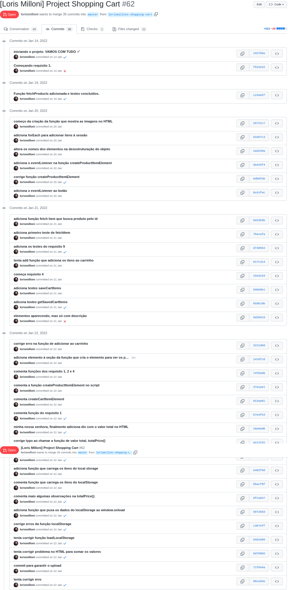
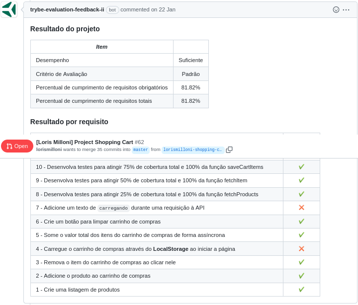

# study-project-shopping-cart
Made in **22/01/2021**.

## In this project I've developed a shopping cart with HTTP requests to an Application Programming Interface from a Latin America famous online store.
#### The goal was to show products that were available requesting the API, and use my knowledge in JavaScript and HTML (with DOM) to add products to cart, add his values and remove products from cart. We also learned how to use async functions, and implemented unit tests.
#### This assignment was a real challenge and I learned a lot. :muscle:
 

#### You can see my website in [this link](https://lorismilloni.github.io/study-project-shopping-cart/).

#### Trybe has a private repository with files that can't be shared. So here is my commit history print:

#### Here is the Trybe Evaluator

